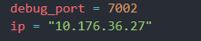
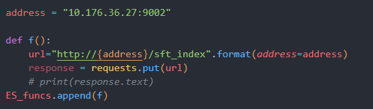

# DynamicDebug

利用Java调试工具JDB自动化处理静态分析输出，用断点拦截请求，寻找真正可触发的代码段

## 1. 使用

**仅支持Unix**

```
python3 ./main.py 
```

**配置**

main.py的测试端口



手动实现要发送的payload，参考sendrequest/tomcat.py, es.py, dubbo.py



sendrequest/myrequest.py里设置发送的payload

**运行**

结果输出在output目录下

* hit_breakpoints.txt: 命中的断点，以及是哪个payload命中的
* jdbout： jdbclient的输出
* taintted_class_type: 受污染的类名

## 自动化jdb的流程

工具自动化的工作等价于手动执行：

```
 jdb -connect com.sun.jdi.SocketAttach:hostname=10.176.36.27,port=7002
 
 methods org.elasticsearch.rest.RestController
 
 stop in org.elasticsearch.rest.RestController.dispatchRequest(org.elasticsearch.rest.RestRequest, org.elasticsearch.rest.RestChannel, org.elasticsearch.common.util.concurrent.ThreadContext) 
 
 locals
 
 print this
```


